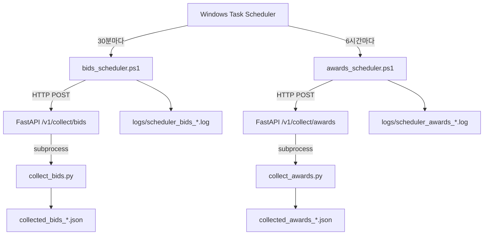

# Step 3-B: Windows Task Scheduler 자동화 가이드

> **Smart Bid Radar - 무인 자동 수집 시스템 구축**

## 📋 목차

1. [개요](#개요)
2. [아키텍처](#아키텍처)
3. [사전 준비](#사전-준비)
4. [PowerShell 스크립트 설정](#powershell-스크립트-설정)
5. [Task Scheduler 등록](#task-scheduler-등록)
6. [권장 스케줄](#권장-스케줄)
7. [모니터링 및 로그](#모니터링-및-로그)
8. [트러블슈팅](#트러블슈팅)
9. [운영 체크리스트](#운영-체크리스트)

---

## 개요

### 목적
- **무인 자동화**: 사람의 개입 없이 입찰·낙찰 데이터를 주기적으로 수집
- **안정성**: 서버 재기동, 네트워크 장애 시에도 자동 복구
- **로깅**: 실행 이력 및 오류 추적 가능

### 시스템 구성
```
Windows Task Scheduler
    ↓ (매 30분 실행)
PowerShell 스크립트 (bids_scheduler.ps1)
    ↓ (HTTP POST)
FastAPI 서버 (localhost:8004)
    ↓ (subprocess 호출)
Step 2 수집 스크립트 (collect_bids.py)
    ↓
JSON 파일 저장 (collected_bids_*.json)
```

### 핵심 원칙
1. **FastAPI 서버는 상시 실행** (백그라운드 프로세스)
2. **PowerShell 스크립트가 API 호출** (서버 코드 수정 불필요)
3. **Task Scheduler가 스크립트 실행** (Windows 네이티브 도구)

---

## 아키텍처

### 실행 흐름



### 구성 요소

| 구성 요소 | 역할 | 실행 주기 |
|----------|------|----------|
| **FastAPI 서버** | API 엔드포인트 제공 | 상시 실행 |
| **bids_scheduler.ps1** | 입찰 수집 API 호출 | 30~60분 |
| **awards_scheduler.ps1** | 낙찰 수집 API 호출 | 6~12시간 |
| **Task Scheduler** | PowerShell 스크립트 자동 실행 | 설정된 주기 |
| **로그 파일** | 실행 이력 및 오류 기록 | 일별 생성 |

---

## 사전 준비

### 1. FastAPI 서버 상시 실행

#### 방법 1: PowerShell 백그라운드 (개발/테스트용)
```powershell
# python 디렉터리로 이동
cd C:\pubcoding\pub_project_05\python

# 가상환경 활성화
.\.venv\Scripts\Activate.ps1

# 백그라운드로 서버 시작
Start-Process powershell -ArgumentList "-NoExit", "-Command", "cd C:\pubcoding\pub_project_05\python; .\.venv\Scripts\Activate.ps1; python api_server.py" -WindowStyle Minimized

# 서버 상태 확인 (3초 대기 후)
Start-Sleep -Seconds 3
Invoke-RestMethod http://localhost:8004/health
```

#### 방법 2: NSSM (Windows Service 등록, 프로덕션 권장)
```powershell
# NSSM 다운로드 (https://nssm.cc/download)
# 압축 해제 후 nssm.exe를 PATH에 추가

# 서비스 등록
nssm install SmartBidRadarAPI "C:\pubcoding\pub_project_05\python\.venv\Scripts\python.exe" "C:\pubcoding\pub_project_05\python\api_server.py"
nssm set SmartBidRadarAPI AppDirectory "C:\pubcoding\pub_project_05\python"
nssm set SmartBidRadarAPI DisplayName "Smart Bid Radar API Server"
nssm set SmartBidRadarAPI Description "FastAPI server for Smart Bid Radar data collection"
nssm set SmartBidRadarAPI Start SERVICE_AUTO_START

# 서비스 시작
nssm start SmartBidRadarAPI

# 상태 확인
nssm status SmartBidRadarAPI
```

#### 방법 3: 시스템 부팅 시 자동 시작 (Task Scheduler 이용)
1. **Task Scheduler 열기** → "작업 만들기"
2. **일반 탭**:
   - 이름: `Smart Bid Radar API Server`
   - 최고 권한 실행: ✅
3. **트리거 탭**:
   - 새로 만들기 → "시스템 시작 시"
4. **동작 탭**:
   - 프로그램 시작: `powershell.exe`
   - 인수 추가:
     ```
     -NoExit -ExecutionPolicy Bypass -Command "cd C:\pubcoding\pub_project_05\python; .\.venv\Scripts\Activate.ps1; python api_server.py"
     ```
   - 시작 위치: `C:\pubcoding\pub_project_05\python`
5. **설정 탭**:
   - 실행 실패 시 다시 시작: ✅ (간격: 1분, 최대 3회)

### 2. PowerShell 실행 정책 설정

```powershell
# 현재 실행 정책 확인
Get-ExecutionPolicy

# RemoteSigned로 변경 (권장)
Set-ExecutionPolicy -ExecutionPolicy RemoteSigned -Scope CurrentUser

# 또는 Bypass (더 관대함, 보안 주의)
Set-ExecutionPolicy -ExecutionPolicy Bypass -Scope CurrentUser
```

### 3. 로그 디렉터리 생성

```powershell
cd C:\pubcoding\pub_project_05\python
mkdir logs -Force
```

### 4. 스크립트 테스트

#### 입찰 수집 테스트
```powershell
cd C:\pubcoding\pub_project_05\python
.\bids_scheduler.ps1
```

**예상 출력**:
```
[2026-01-01 10:00:00] [INFO] ========================================
[2026-01-01 10:00:00] [INFO] 입찰 데이터 수집 시작
[2026-01-01 10:00:00] [INFO] Mode: mock
[2026-01-01 10:00:00] [INFO] Timestamp: 20260101_100000
[2026-01-01 10:00:01] [INFO] API 호출 시도 1/3
[2026-01-01 10:00:02] [SUCCESS] ✅ 수집 성공
[2026-01-01 10:00:02] [INFO] Run ID: auto_bids_20260101_100000
[2026-01-01 10:00:02] [INFO] 수집 건수: 300
[2026-01-01 10:00:02] [INFO] 저장 건수: 300
[2026-01-01 10:00:02] [INFO] 소요 시간: 0.21초
[2026-01-01 10:00:02] [INFO] 입찰 데이터 수집 완료 ✅
```

#### 낙찰 수집 테스트
```powershell
cd C:\pubcoding\pub_project_05\python
.\awards_scheduler.ps1
```

---

## PowerShell 스크립트 설정

### bids_scheduler.ps1 설정

#### 주요 설정값

| 변수 | 기본값 | 설명 | 변경 가능 여부 |
|------|-------|------|---------------|
| `$API_BASE_URL` | `http://localhost:8004` | FastAPI 서버 주소 | ⚙️ (포트 변경 시) |
| `$MODE` | `mock` | 수집 모드 (mock/real) | ✅ (Real API 승인 후 변경) |
| `$MAX_RETRIES` | `2` | 최대 재시도 횟수 | ✅ |
| `$RETRY_DELAY_SECONDS` | `30` | 재시도 대기 시간 | ✅ |
| `pages` | `3` | 수집 페이지 수 | ✅ (API 본문 내) |

#### Mock → Real 모드 전환

```powershell
# bids_scheduler.ps1 편집 (라인 10)
$MODE = "real"  # mock에서 real로 변경
```

**주의사항**:
- Real 모드 전환 전 **공공데이터포털 활용신청 승인 확인** 필수
- API 키가 .env 파일에 정확히 설정되어 있는지 확인
- 첫 Real 실행 후 `data_quality.py`로 품질 검증 권장

### awards_scheduler.ps1 설정

#### 주요 차이점
- `$RETRY_DELAY_SECONDS = 60` (입찰보다 긴 대기 시간)
- `pages = 2` (낙찰 데이터는 입찰보다 적음)
- **입찰 파일 자동 탐색**: 최신 `collected_bids_*_auto_bids_*.json` 자동 사용

#### 입찰 파일 수동 지정 (필요 시)

```powershell
# awards_scheduler.ps1 편집 (라인 47~48)
# 자동 탐색 코드 주석 처리 후 수동 지정
$latestBidsFile = "collected_bids_real_prod_001.json"
```

---

## Task Scheduler 등록

### 입찰 수집 작업 등록

#### 1. Task Scheduler 열기
- **시작 메뉴** → "작업 스케줄러" 검색 → 실행
- 또는 `Win+R` → `taskschd.msc` 입력

#### 2. 작업 만들기
- 우측 패널 → **"작업 만들기"** 클릭

#### 3. 일반 탭 설정

| 항목 | 값 | 설명 |
|------|---|------|
| **이름** | `SmartBidRadar - 입찰 수집` | 작업 식별 이름 |
| **설명** | `입찰 데이터 자동 수집 (30분 주기)` | 작업 설명 |
| **보안 옵션** | "사용자의 로그온 여부와 관계없이 실행" | ✅ 체크 (백그라운드 실행) |
| **최고 권한** | ✅ 체크 | PowerShell 실행 권한 |
| **구성 대상** | Windows 10 | OS 버전 선택 |

#### 4. 트리거 탭 설정

| 항목 | 값 | 설명 |
|------|---|------|
| **트리거 시작** | "일정에 따라" | 주기적 실행 |
| **설정** | 매일 | 날짜 제약 없음 |
| **시작 시간** | 오전 6:00 | 첫 실행 시각 |
| **반복 간격** | 30분 | 30분마다 실행 |
| **기간** | 1일 | 24시간 반복 |
| **사용** | ✅ 체크 | 트리거 활성화 |

**트리거 설정 예시**:
```
매일 오전 6:00에 시작
매 30분마다 1일 동안 작업을 반복합니다.
```

#### 5. 동작 탭 설정

| 항목 | 값 |
|------|---|
| **프로그램/스크립트** | `powershell.exe` |
| **인수 추가** | `-ExecutionPolicy Bypass -File "C:\pubcoding\pub_project_05\python\bids_scheduler.ps1"` |
| **시작 위치** | `C:\pubcoding\pub_project_05\python` |

#### 6. 조건 탭 설정

| 항목 | 설정 | 이유 |
|------|-----|------|
| **AC 전원에 연결되어 있을 경우만 작업 시작** | ❌ 체크 해제 | 노트북 환경에서도 실행 |
| **AC 전원으로 전환 시 다시 시작** | ✅ 체크 | 배터리→AC 전환 시 재개 |
| **작업을 실행하기 위해 절전 모드 해제** | ✅ 체크 | 절전 모드에서도 실행 |

#### 7. 설정 탭 설정

| 항목 | 설정 | 이유 |
|------|-----|------|
| **작업 실행 실패 시 다시 시작 간격** | ✅ 체크, 1분 간격, 최대 3회 | 일시적 오류 자동 복구 |
| **작업이 요청 시 중지되지 않으면 강제로 중지** | ✅ 체크 | 무한 대기 방지 |
| **작업이 이미 실행 중인 경우** | "새 인스턴스를 시작하지 않음" | 중복 실행 방지 |

#### 8. 확인 및 저장
- **확인** 클릭 → Windows 계정 비밀번호 입력 (요청 시)
- 작업 스케줄러 라이브러리에서 등록 확인

### 낙찰 수집 작업 등록

#### 트리거 설정만 다름 (나머지 동일)

| 항목 | 값 | 설명 |
|------|---|------|
| **이름** | `SmartBidRadar - 낙찰 수집` | 작업 식별 이름 |
| **프로그램 인수** | `-ExecutionPolicy Bypass -File "C:\pubcoding\pub_project_05\python\awards_scheduler.ps1"` | awards 스크립트 |
| **반복 간격** | 6시간 | 6시간마다 실행 |
| **시작 시간** | 오전 7:00 | 입찰 수집 1시간 후 |

**권장 이유**:
- 낙찰 수집은 **입찰 파일이 먼저 생성되어야 함**
- 입찰 수집이 6:00 시작 → 7:00에는 파일 존재 보장

---

## 권장 스케줄

### 프로덕션 권장 설정

| 데이터 유형 | 주기 | 시작 시각 | 이유 |
|------------|------|----------|------|
| **입찰** | 30분 | 오전 6:00 | 새벽 6시부터 30분마다 실행 (하루 48회) |
| **낙찰** | 6시간 | 오전 7:00 | 입찰 데이터 생성 후 실행 (하루 4회) |

### 실행 시간표 예시

```
06:00 - 입찰 수집 (1회)
06:30 - 입찰 수집 (2회)
07:00 - 입찰 수집 (3회) + 낙찰 수집 (1회)
07:30 - 입찰 수집 (4회)
...
13:00 - 입찰 수집 (15회) + 낙찰 수집 (2회)
...
19:00 - 입찰 수집 (27회) + 낙찰 수집 (3회)
...
01:00 - 입찰 수집 (39회) + 낙찰 수집 (4회)
```

### 주의사항

#### 1. 중복 실행 방지
- Task Scheduler 설정: **"새 인스턴스를 시작하지 않음"**
- PowerShell 스크립트 실행 시간이 30분을 초과할 경우 다음 실행은 건너뜀
- 로그에서 `[WARN] 이전 작업이 아직 실행 중입니다` 확인 가능

#### 2. API Rate Limit
- 공공데이터포털 제한: **1초당 10건, 일 100,000건**
- 현재 설정 (30분 주기, 3페이지=300건): 일 14,400건 (안전)
- Real 모드 시 재시도 로직으로 429 에러 자동 대응

#### 3. 서버 재시작 시나리오
- **시나리오**: PC 재부팅 → FastAPI 서버 종료
- **대응**: NSSM 또는 시스템 시작 시 Task로 서버 자동 재시작
- **백업**: PowerShell 스크립트에서 서버 Health Check 실패 시 로그 기록

---

## 모니터링 및 로그

### 로그 파일 위치

```
C:\pubcoding\pub_project_05\python\logs\
├── scheduler_bids_20260101.log      # 입찰 수집 로그 (일별)
├── scheduler_bids_20260102.log
├── scheduler_awards_20260101.log    # 낙찰 수집 로그 (일별)
└── scheduler_awards_20260102.log
```

### 로그 포맷

```
[YYYY-MM-DD HH:MM:SS] [LEVEL] MESSAGE
```

#### 로그 레벨

| 레벨 | 의미 | 예시 |
|------|-----|------|
| `INFO` | 정상 실행 정보 | API 호출 시도, 수집 건수 |
| `SUCCESS` | 성공 상태 | 수집 완료 |
| `DEBUG` | 디버그 정보 | 요청 본문, 파일 크기 |
| `WARN` | 경고 (실행 계속) | 재시도 대기, 입찰 파일 없음 |
| `ERROR` | 오류 (실행 중단) | API 호출 실패, 서버 응답 없음 |

### 로그 예시

#### 성공 케이스
```
[2026-01-01 10:00:00] [INFO] ========================================
[2026-01-01 10:00:00] [INFO] 입찰 데이터 수집 시작
[2026-01-01 10:00:00] [INFO] Mode: mock
[2026-01-01 10:00:00] [INFO] Timestamp: 20260101_100000
[2026-01-01 10:00:01] [INFO] API 호출 시도 1/3
[2026-01-01 10:00:02] [SUCCESS] ✅ 수집 성공
[2026-01-01 10:00:02] [INFO] Run ID: auto_bids_20260101_100000
[2026-01-01 10:00:02] [INFO] Trace ID: trace_a1b2c3d4e5f6
[2026-01-01 10:00:02] [INFO] 수집 건수: 300
[2026-01-01 10:00:02] [INFO] 저장 건수: 300
[2026-01-01 10:00:02] [INFO] 오류 건수: 0
[2026-01-01 10:00:02] [INFO] 소요 시간: 0.21초
[2026-01-01 10:00:02] [INFO] 파일 경로: collected_bids_mock_auto_bids_20260101_100000.json
[2026-01-01 10:00:02] [INFO] 입찰 데이터 수집 완료 ✅
[2026-01-01 10:00:02] [INFO] ========================================
```

#### 재시도 케이스
```
[2026-01-01 11:00:01] [INFO] API 호출 시도 1/3
[2026-01-01 11:00:05] [ERROR] ❌ API 호출 오류
[2026-01-01 11:00:05] [ERROR] 오류 메시지: Connection refused
[2026-01-01 11:00:05] [ERROR] ⚠️ 서버 응답 없음 - 서버가 실행 중인지 확인하세요
[2026-01-01 11:00:05] [WARN] 재시도 대기 중 (30초)...
[2026-01-01 11:00:35] [INFO] API 호출 시도 2/3
[2026-01-01 11:00:36] [SUCCESS] ✅ 수집 성공
```

#### 최종 실패 케이스
```
[2026-01-01 12:00:01] [INFO] API 호출 시도 1/3
[2026-01-01 12:00:05] [ERROR] ❌ API 호출 오류
[2026-01-01 12:00:35] [INFO] API 호출 시도 2/3
[2026-01-01 12:00:40] [ERROR] ❌ API 호출 오류
[2026-01-01 12:01:10] [INFO] API 호출 시도 3/3
[2026-01-01 12:01:15] [ERROR] ❌ API 호출 오류
[2026-01-01 12:01:15] [ERROR] 입찰 데이터 수집 실패 (최대 재시도 횟수 초과) ❌
[2026-01-01 12:01:15] [ERROR] ========================================
```

### 로그 모니터링

#### 실시간 로그 확인 (PowerShell)
```powershell
# 입찰 로그 실시간 추적
Get-Content "C:\pubcoding\pub_project_05\python\logs\scheduler_bids_$(Get-Date -Format 'yyyyMMdd').log" -Wait -Tail 10

# 낙찰 로그 실시간 추적
Get-Content "C:\pubcoding\pub_project_05\python\logs\scheduler_awards_$(Get-Date -Format 'yyyyMMdd').log" -Wait -Tail 10
```

#### 오류 검색
```powershell
# 오늘 에러 로그 검색
Select-String -Path "C:\pubcoding\pub_project_05\python\logs\scheduler_bids_$(Get-Date -Format 'yyyyMMdd').log" -Pattern "\[ERROR\]"

# 최근 7일 에러 로그 검색
Get-ChildItem "C:\pubcoding\pub_project_05\python\logs\scheduler_bids_*.log" | 
    Where-Object { $_.LastWriteTime -gt (Get-Date).AddDays(-7) } | 
    Select-String -Pattern "\[ERROR\]"
```

#### 성공률 계산
```powershell
# 오늘 실행 성공/실패 횟수
$logFile = "C:\pubcoding\pub_project_05\python\logs\scheduler_bids_$(Get-Date -Format 'yyyyMMdd').log"
$success = (Select-String -Path $logFile -Pattern "수집 완료 ✅").Count
$failure = (Select-String -Path $logFile -Pattern "수집 실패.*❌").Count
Write-Output "성공: $success, 실패: $failure, 성공률: $([math]::Round($success/($success+$failure)*100, 2))%"
```

### 로그 정리 (디스크 공간 관리)

#### 30일 이상 된 로그 삭제
```powershell
# 수동 실행
Get-ChildItem "C:\pubcoding\pub_project_05\python\logs\scheduler_*.log" | 
    Where-Object { $_.LastWriteTime -lt (Get-Date).AddDays(-30) } | 
    Remove-Item -Force

# Task Scheduler로 자동화 (주 1회)
# 작업 이름: "SmartBidRadar - 로그 정리"
# 트리거: 매주 일요일 오전 2:00
# 동작: powershell.exe
# 인수: -ExecutionPolicy Bypass -Command "Get-ChildItem 'C:\pubcoding\pub_project_05\python\logs\scheduler_*.log' | Where-Object { $_.LastWriteTime -lt (Get-Date).AddDays(-30) } | Remove-Item -Force"
```

---

## 트러블슈팅

### 문제 1: 스크립트 실행 시 "실행할 수 없습니다" 오류

#### 증상
```
이 시스템에서 스크립트를 실행할 수 없으므로 C:\...\bids_scheduler.ps1 파일을 로드할 수 없습니다.
```

#### 원인
PowerShell 실행 정책이 Restricted로 설정됨

#### 해결
```powershell
# 실행 정책 확인
Get-ExecutionPolicy

# RemoteSigned로 변경
Set-ExecutionPolicy -ExecutionPolicy RemoteSigned -Scope CurrentUser

# 또는 Task Scheduler 인수에 -ExecutionPolicy Bypass 추가 (이미 포함됨)
```

---

### 문제 2: Task Scheduler에서 실행되지 않음 (수동 실행은 성공)

#### 증상
- PowerShell에서 직접 실행: ✅ 성공
- Task Scheduler에서 실행: ❌ 실패 (마지막 실행 결과: 0x1)

#### 원인
1. 시작 위치(Start in) 미설정
2. 경로에 공백 포함 시 따옴표 누락
3. 상대 경로 사용

#### 해결
```
1. Task Scheduler 작업 편집
2. 동작 탭 → "시작 위치" 필드 입력
   C:\pubcoding\pub_project_05\python
3. 인수에 전체 경로를 따옴표로 감싸기
   -ExecutionPolicy Bypass -File "C:\pubcoding\pub_project_05\python\bids_scheduler.ps1"
```

---

### 문제 3: 서버 응답 없음 (Connection refused)

#### 증상
```
[ERROR] ❌ API 호출 오류
[ERROR] 오류 메시지: Connect failed: Connection refused
[ERROR] ⚠️ 서버 응답 없음 - 서버가 실행 중인지 확인하세요
```

#### 원인
FastAPI 서버가 실행되지 않음

#### 해결
```powershell
# 1. 서버 프로세스 확인
Get-Process | Where-Object { $_.ProcessName -like "*python*" }

# 2. 포트 8004 사용 중인지 확인
netstat -ano | findstr :8004

# 3. 서버 재시작
cd C:\pubcoding\pub_project_05\python
.\.venv\Scripts\Activate.ps1
python api_server.py

# 또는 NSSM 사용 시
nssm restart SmartBidRadarAPI
```

---

### 문제 4: 낙찰 수집 시 "입찰 파일을 찾을 수 없습니다"

#### 증상
```
[WARN] ⚠️ 입찰 파일을 찾을 수 없습니다
[ERROR] 낙찰 수집은 입찰 데이터가 필요합니다
```

#### 원인
1. 입찰 수집이 아직 실행되지 않음
2. 파일 패턴 불일치 (run_id 명명 규칙 변경됨)

#### 해결
```powershell
# 1. 입찰 파일 존재 확인
Get-ChildItem "C:\pubcoding\pub_project_05\python\collected_bids_*_auto_bids_*.json" | Select-Object Name, LastWriteTime

# 2. 파일이 없으면 입찰 수집 먼저 실행
.\bids_scheduler.ps1

# 3. 파일 패턴이 다르면 awards_scheduler.ps1 편집 (라인 11)
$BIDS_FILE_PATTERN = "collected_bids_*.json"  # 패턴 완화
```

---

### 문제 5: Task 실행 후 종료 코드 0x1

#### 증상
Task Scheduler 이력:
```
작업 "SmartBidRadar - 입찰 수집"(인스턴스 "C:\Windows\System32\WindowsPowerShell\v1.0\powershell.exe")이(가) 시작되었습니다.
작업 실행 결과: 0x1
```

#### 원인
PowerShell 스크립트 내부에서 `exit 1` 반환 (수집 실패)

#### 해결
```powershell
# 1. 로그 파일 확인
$logFile = "C:\pubcoding\pub_project_05\python\logs\scheduler_bids_$(Get-Date -Format 'yyyyMMdd').log"
Get-Content $logFile -Tail 50

# 2. 오류 원인 파악 후 조치
# - 서버 재시작
# - API 키 확인
# - 네트워크 연결 확인

# 3. 수동 재실행 테스트
cd C:\pubcoding\pub_project_05\python
.\bids_scheduler.ps1
```

---

### 문제 6: Real 모드 전환 후 401/403 에러

#### 증상
```
[ERROR] 오류 메시지: 401 Unauthorized
또는
[ERROR] 오류 메시지: 403 Forbidden
```

#### 원인
1. API 키 미설정 또는 잘못된 키
2. 공공데이터포털 활용신청 미승인
3. API 키 만료

#### 해결
```powershell
# 1. .env 파일 확인
cd C:\pubcoding\pub_project_05\python
Get-Content .env | Select-String "DATA_PORTAL_API_KEY"

# 2. 공공데이터포털 마이페이지에서 승인 상태 확인
# https://www.data.go.kr/uim/mypage/selectMyActivatPage.do

# 3. API 키 재발급 및 .env 업데이트
# (공공데이터포털에서 재발급 → .env 수정 → 서버 재시작)

# 4. 테스트 실행
.\bids_scheduler.ps1
```

---

### 문제 7: 429 Too Many Requests

#### 증상
```
[ERROR] 오류 메시지: 429 Too Many Requests
```

#### 원인
API Rate Limit 초과 (1초당 10건, 일 100,000건)

#### 해결
```
자동 처리됨:
1. PowerShell 스크립트가 30초 대기 후 재시도
2. collect_bids.py 내부에서도 30초 대기 후 재시도
3. 최대 3회 재시도 후 실패 시 다음 스케줄에서 재시도

수동 조치 (반복 발생 시):
1. Task Scheduler 주기 완화 (30분 → 60분)
2. pages 수 감소 (3 → 2)
3. 공공데이터포털에서 일일 허용량 확인
```

---

## 운영 체크리스트

### 최초 배포 시 체크리스트

- [ ] **FastAPI 서버 상시 실행 설정**
  - [ ] NSSM 서비스 등록 또는 시스템 시작 시 Task 등록
  - [ ] 서버 Health Check 정상 (`http://localhost:8004/health`)

- [ ] **PowerShell 실행 정책 설정**
  - [ ] `Get-ExecutionPolicy` → RemoteSigned 이상

- [ ] **로그 디렉터리 생성**
  - [ ] `C:\pubcoding\pub_project_05\python\logs` 존재 확인

- [ ] **스크립트 수동 테스트**
  - [ ] `.\bids_scheduler.ps1` 실행 → 성공 확인
  - [ ] `.\awards_scheduler.ps1` 실행 → 성공 확인
  - [ ] 로그 파일 생성 확인

- [ ] **Task Scheduler 등록**
  - [ ] 입찰 수집 작업 (30분 주기)
  - [ ] 낙찰 수집 작업 (6시간 주기)
  - [ ] 시작 위치 설정 (`C:\pubcoding\pub_project_05\python`)
  - [ ] 최고 권한 실행 체크

- [ ] **첫 실행 모니터링**
  - [ ] Task Scheduler 이력에서 첫 실행 성공 확인
  - [ ] 로그 파일에서 `[SUCCESS]` 확인
  - [ ] JSON 파일 생성 확인

### 주간 모니터링 체크리스트

- [ ] **로그 파일 확인**
  - [ ] 에러 로그 검색 (`[ERROR]`)
  - [ ] 성공률 계산 (목표: 95% 이상)
  - [ ] 연속 실패 3회 이상 시 알람

- [ ] **수집 데이터 확인**
  - [ ] JSON 파일 개수 확인 (입찰: 주 336개, 낙찰: 주 28개)
  - [ ] 파일 크기 정상 범위 확인 (입찰: 50~150KB, 낙찰: 10~50KB)
  - [ ] `data_quality.py`로 품질 검증 (샘플링)

- [ ] **서버 상태 확인**
  - [ ] FastAPI 서버 프로세스 실행 중 확인
  - [ ] Health Check API 응답 확인
  - [ ] 메모리 사용량 모니터링

- [ ] **Task Scheduler 상태 확인**
  - [ ] 작업 사용 상태 확인 (비활성화되지 않았는지)
  - [ ] 마지막 실행 시간 확인 (최근 30분 이내)
  - [ ] 다음 실행 시간 확인 (정상 스케줄링)

### 월간 유지보수 체크리스트

- [ ] **로그 정리**
  - [ ] 30일 이상 된 로그 파일 삭제
  - [ ] 디스크 공간 확인

- [ ] **데이터 정리**
  - [ ] 90일 이상 된 JSON 파일 아카이브 또는 삭제
  - [ ] Firestore 저장 시 로컬 파일 정리 규칙 수립

- [ ] **성능 분석**
  - [ ] 월간 수집 성공률 집계
  - [ ] 평균 수집 시간 추이 분석
  - [ ] API Rate Limit 근접도 확인

- [ ] **보안 점검**
  - [ ] API 키 만료 여부 확인
  - [ ] .env 파일 권한 확인 (읽기 전용)
  - [ ] PowerShell 스크립트 무단 수정 여부 확인

---

## 권장 설정 요약표

### Task Scheduler 설정 요약

| 구분 | 입찰 수집 | 낙찰 수집 |
|------|----------|----------|
| **작업 이름** | SmartBidRadar - 입찰 수집 | SmartBidRadar - 낙찰 수집 |
| **프로그램** | `powershell.exe` | `powershell.exe` |
| **인수** | `-ExecutionPolicy Bypass -File "C:\pubcoding\pub_project_05\python\bids_scheduler.ps1"` | `-ExecutionPolicy Bypass -File "C:\pubcoding\pub_project_05\python\awards_scheduler.ps1"` |
| **시작 위치** | `C:\pubcoding\pub_project_05\python` | `C:\pubcoding\pub_project_05\python` |
| **시작 시간** | 오전 6:00 | 오전 7:00 |
| **반복 간격** | 30분 | 6시간 |
| **최고 권한** | ✅ | ✅ |
| **로그온 여부 무관** | ✅ | ✅ |
| **절전 모드 해제** | ✅ | ✅ |
| **재시도 설정** | 1분 간격, 최대 3회 | 1분 간격, 최대 3회 |

### PowerShell 스크립트 설정 요약

| 설정 | bids_scheduler.ps1 | awards_scheduler.ps1 |
|------|-------------------|---------------------|
| **API 엔드포인트** | `/v1/collect/bids` | `/v1/collect/awards` |
| **MODE** | `mock` (Real 전환 가능) | `mock` (Real 전환 가능) |
| **pages** | `3` | `2` |
| **MAX_RETRIES** | `2` | `2` |
| **RETRY_DELAY** | `30초` | `60초` |
| **로그 파일** | `logs/scheduler_bids_YYYYMMDD.log` | `logs/scheduler_awards_YYYYMMDD.log` |
| **run_id 형식** | `auto_bids_YYYYMMDD_HHMMSS` | `auto_awards_YYYYMMDD_HHMMSS` |

### 예상 실행 횟수 및 데이터량

| 구분 | 일 | 주 | 월 | 연 |
|------|---|---|---|---|
| **입찰 수집 실행** | 48회 | 336회 | 1,440회 | 17,520회 |
| **낙찰 수집 실행** | 4회 | 28회 | 120회 | 1,460회 |
| **입찰 데이터** | 14,400건 | 100,800건 | 432,000건 | 5,256,000건 |
| **낙찰 데이터** | 400건 | 2,800건 | 12,000건 | 146,000건 |
| **로그 파일** | 2개 | 14개 | 60개 | 730개 |
| **JSON 파일** | 52개 | 364개 | 1,560개 | 18,980개 |
| **디스크 사용량** | ~5MB | ~35MB | ~150MB | ~1.8GB |

---

## 고급 운영 팁

### 1. 서버 Health Check 자동 알림

#### Health Check 스크립트 (health_monitor.ps1)
```powershell
$API_URL = "http://localhost:8004/health"
$SLACK_WEBHOOK = "https://hooks.slack.com/services/YOUR/WEBHOOK/URL"  # 선택사항

try {
    $response = Invoke-RestMethod -Uri $API_URL -TimeoutSec 5
    Write-Output "✅ 서버 정상: $($response.timestamp)"
} catch {
    Write-Output "❌ 서버 다운: $($_.Exception.Message)"
    
    # Slack 알림 (선택사항)
    if ($SLACK_WEBHOOK) {
        $body = @{
            text = "🚨 Smart Bid Radar API 서버 다운: $($_.Exception.Message)"
        } | ConvertTo-Json
        Invoke-RestMethod -Uri $SLACK_WEBHOOK -Method Post -Body $body -ContentType "application/json"
    }
    
    exit 1
}
```

#### Task Scheduler 등록 (5분마다)
```
작업 이름: SmartBidRadar - Health Check
트리거: 매 5분마다
프로그램: powershell.exe
인수: -ExecutionPolicy Bypass -File "C:\pubcoding\pub_project_05\python\health_monitor.ps1"
```

### 2. 수집 데이터 자동 백업

#### 백업 스크립트 (backup_data.ps1)
```powershell
$SOURCE_DIR = "C:\pubcoding\pub_project_05\python"
$BACKUP_DIR = "D:\Backup\SmartBidRadar"
$DATE = Get-Date -Format "yyyyMMdd"

# 백업 디렉터리 생성
$BACKUP_PATH = Join-Path $BACKUP_DIR $DATE
New-Item -ItemType Directory -Path $BACKUP_PATH -Force | Out-Null

# JSON 파일 압축
Compress-Archive -Path "$SOURCE_DIR\collected_*.json" -DestinationPath "$BACKUP_PATH\data_$DATE.zip" -Force

# 로그 파일 압축
Compress-Archive -Path "$SOURCE_DIR\logs\scheduler_*.log" -DestinationPath "$BACKUP_PATH\logs_$DATE.zip" -Force

Write-Output "✅ 백업 완료: $BACKUP_PATH"
```

#### Task Scheduler 등록 (매일 새벽 3시)
```
작업 이름: SmartBidRadar - 데이터 백업
트리거: 매일 오전 3:00
프로그램: powershell.exe
인수: -ExecutionPolicy Bypass -File "C:\pubcoding\pub_project_05\python\backup_data.ps1"
```

### 3. Mock → Real 자동 전환

#### 전제조건
- 공공데이터포털 활용신청 승인 완료
- Real 모드로 수동 테스트 성공

#### 전환 절차
```powershell
# 1. bids_scheduler.ps1 편집
(Get-Content bids_scheduler.ps1) -replace '$MODE = "mock"', '$MODE = "real"' | Set-Content bids_scheduler.ps1

# 2. awards_scheduler.ps1 편집
(Get-Content awards_scheduler.ps1) -replace '$MODE = "mock"', '$MODE = "real"' | Set-Content awards_scheduler.ps1

# 3. 수동 테스트
.\bids_scheduler.ps1

# 4. 품질 검증
python data_quality.py --source real --input collected_bids_real_auto_bids_*.json --run-id test
```

---

## 마무리

### Step 3-B 완료 기준

- [x] bids_scheduler.ps1 작성
- [x] awards_scheduler.ps1 작성
- [x] Task Scheduler 등록 (2개 작업)
- [x] 로그 파일 정상 생성
- [x] 자동 수집 성공 (최소 1회)
- [x] 문서화 완료 (Step3B_SCHEDULER_GUIDE.md)

### 다음 단계 (Step 4)

**Step 4: Firestore 연동 (데이터 영속화)**
- [ ] collect_bids.py → Firestore 저장 로직 추가
- [ ] collect_awards.py → Firestore 저장 로직 추가
- [ ] 프론트엔드 실시간 데이터 바인딩
- [ ] 히스토리 데이터 축적 (최소 1,000건)

---

**작성일**: 2026-01-01  
**버전**: 1.0  
**작성자**: Smart Bid Radar Team
